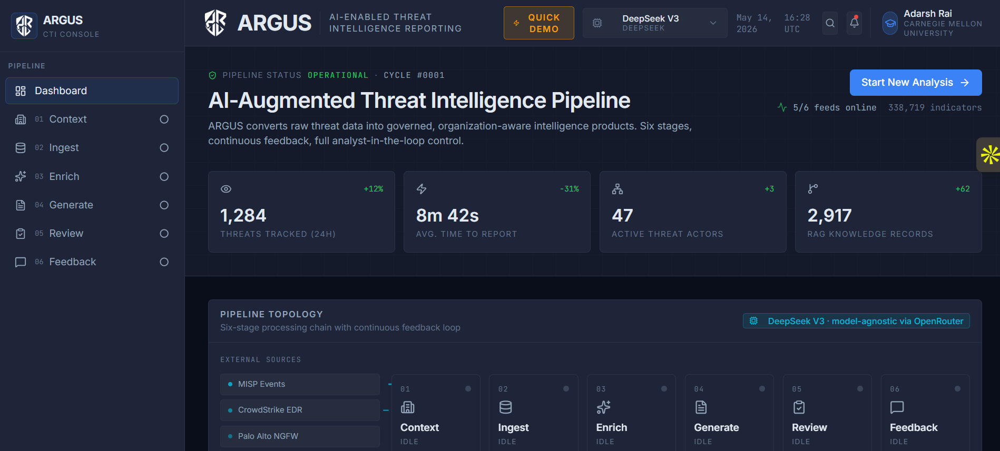
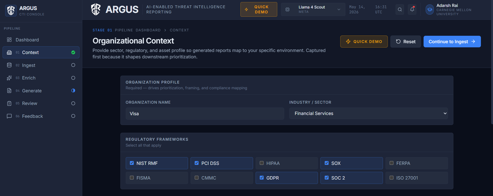
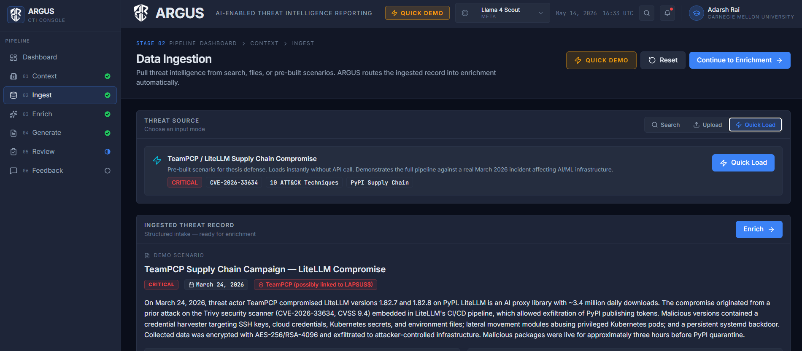
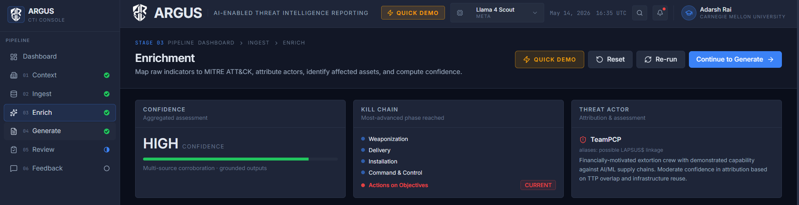
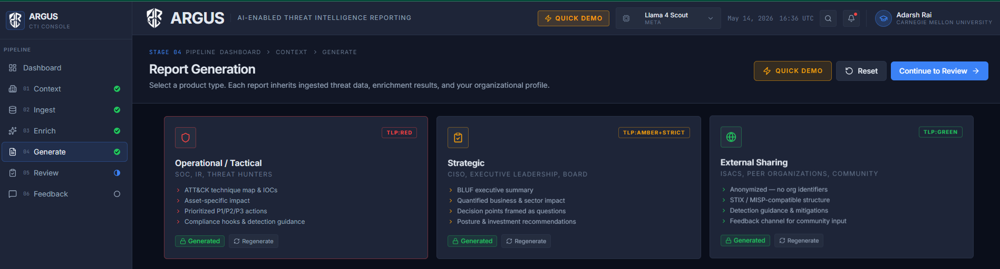
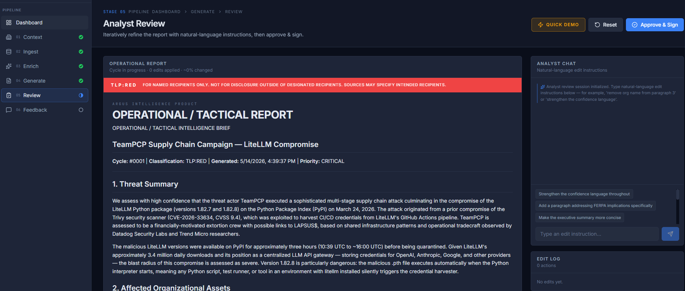
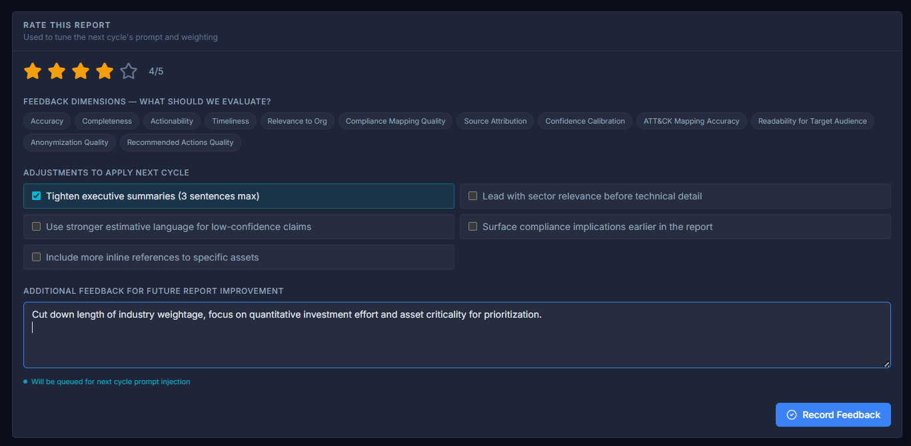
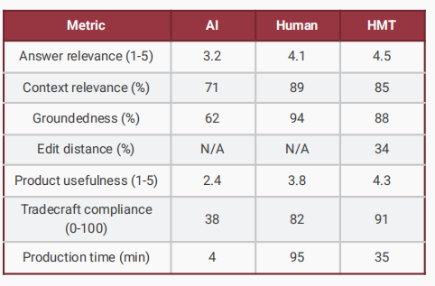

# Argus CTI

[](#license)
[](https://nextjs.org/)
[](https://www.typescriptlang.org/)
[](https://argus-cti.vercel.app)
[](https://openrouter.ai/)

Single-agent system with tool calling that ingests OSINT feeds, enriches with MITRE ATT&CK mappings via an ETL pipeline, and generates tailored intelligence products for three audiences. Built as a CMU thesis project at the Software Engineering Institute. Model-agnostic generation across 8 LLMs via OpenRouter. Human-AI teaming scored 91/100 on tradecraft compliance, cutting report production from 205 minutes to 35.

[Live Demo](https://argus-cti.vercel.app) · [Research Paper](https://drive.google.com/file/d/15vLA_pAFm88RTSFJSCMEhoTcF9wtPT9S/view?usp=sharing) · [Thesis Defense](https://youtu.be/NFk96HkcDRo?si=ZUPRY0ci3hTs2dt0) · [Portfolio](https://adarsh-rai.com)



## The Problem

AI research in CTI clusters around data collection and threat analysis. 41 of 54 papers reviewed for this thesis addressed those upstream phases. Only 5 addressed reporting, feedback, or human-machine teaming with implemented tooling. Argus treats intelligence product generation as the primary design target, not a byproduct of extraction.

## Pipeline

Six stages run as a single-agent system with tool calling. State lives in a React context; there is no database.

| Stage | Route | What happens |
|---|---|---|
| 01 Context | `/context` | Analyst configures org profile: sector, regulatory frameworks, critical assets, intelligence priorities |
| 02 Ingest | `/ingest` | Raw threat data enters via search query, file upload, or cached demo. LLM structures it into a normalized threat record |
| 03 Enrich | `/enrich` | ATT&CK technique mapping, kill chain phasing, actor profiling, asset cross-referencing, confidence scoring |
| 04 Generate | `/generate` | LLM produces draft intelligence reports in three formats: operational (TLP:RED), strategic (TLP:AMBER+STRICT), external sharing (TLP:GREEN) |
| 05 Review | `/review` | Chat-based analyst refinement with tracked edits. Approval with analyst sign-off required |
| 06 Feedback | `/feedback` | Analyst rates the cycle, logs adjustments. Feedback injected into next cycle's generation prompt |









The same evidence base produces three different reports:

- **Operational/Tactical Brief (TLP:RED).** For SOC analysts and incident responders. IOCs, ATT&CK mappings, affected assets from the org's inventory, P1/P2/P3 recommended actions with time windows.
- **Strategic Brief (TLP:AMBER+STRICT).** For CISO and board. BLUF executive summary, quantified business impact, compliance implications, decision points framed as questions.
- **External Sharing Product (TLP:GREEN).** For ISACs and peer orgs. All org identifiers stripped. STIX/MISP-compatible structure.





## Tech Stack

| Layer | Technology |
|---|---|
| Framework | Next.js 14 (App Router) |
| Language | TypeScript 5 (strict mode) |
| Frontend | React 18, Tailwind CSS 3.4, Framer Motion |
| Report rendering | react-markdown |
| LLM gateway | OpenRouter API |
| Selectable models | DeepSeek V3, Gemini 2.0/2.5 Flash, Llama 4 Maverick/Scout, GPT-4o, Claude Sonnet |
| State | React Context (no database, all state in browser memory) |
| Hosting | Vercel |
| Data storage | AWS S3 (feed data) |

## Quick Start

```bash
git clone https://github.com/adarsh-rai-secure/argus-cti.git
cd argus-cti
npm install
echo "OPENROUTER_API_KEY=sk-or-v1-..." > .env.local
npm run dev
# Open http://localhost:3000
```

One env var: `OPENROUTER_API_KEY`. Free-tier models (DeepSeek V3, Gemini Flash, Llama 4) work without payment.

**Quick Demo (no API key needed).** Press "Quick Demo" in the header. The full pipeline loads against the TeamPCP/LiteLLM scenario with pre-generated reports. No API calls.

## Demo Scenario

The cached demo uses a real-world-inspired scenario: TeamPCP / LiteLLM supply chain compromise (March 24, 2026). The org profile is a financial services firm modeled on Visa with PCI-DSS, NIST RMF, SOX, GDPR, and SOC 2 obligations. The bundle includes 10 ATT&CK techniques, CVE-2026-33634, 4 IOC categories, and a 10-asset inventory.

## Evaluation

Seven-metric framework comparing AI-only, human-only, and human+AI conditions:

| Metric | AI Only | Human Only | Human + AI |
|---|---|---|---|
| Answer Relevance (1-5) | 3.2 | 4.1 | 4.5 |
| Context Relevance (%) | 71 | 89 | 85 |
| Groundedness (%) | 62 | 94 | 88 |
| Edit Distance (%) | N/A | N/A | 34 |
| Product Usefulness (1-5) | 2.4 | 3.8 | 4.3 |
| Tradecraft Compliance (0-100) | 38 | 82 | 91 |
| Production Time (min) | 4 | 95 | 35 |

AI on its own is fast but unreliable: low groundedness, weak tradecraft compliance. Human-only is accurate but slow. The combined condition hits the highest tradecraft compliance and product usefulness scores while cutting production time by 63% against human-only.



## Key Files

| File | Purpose |
|---|---|
| `src/lib/pipeline-context.tsx` | React context holding the pipeline state machine |
| `src/lib/llm.ts` | OpenRouter gateway, system prompt, JSON extractor |
| `src/lib/demo-data.ts` | Cached demo scenario data |
| `src/lib/cached-reports.ts` | Pre-generated reports for demo mode |
| `src/app/api/generate/route.ts` | Report generation with section guides and feedback injection |
| `src/app/api/enrich/route.ts` | ATT&CK mapping and structured enrichment |
| `src/app/review/page.tsx` | Analyst review with chat editing, edit tracking, approval |

## Known Limitations

This is a thesis prototype, not production software.

- PDF upload parsing is stubbed. Paste extracted text into the search query instead.
- Asset inventory is fixed at 10 records regardless of org profile.
- No streaming. Every LLM call blocks until OpenRouter returns.
- No authentication. The deployed instance is publicly reachable.
- No tests.
- 2500-token output cap on `/api/generate` causes truncation on longer reports.
- Dashboard stats (1,284 threats, 8m 42s, etc.) are decorative, not live metrics.
- Threat feed integrations (CISA KEV, AlienVault OTX, MISP, NVD, VirusTotal) are simulated via static data.

## Security Considerations

- API keys live in environment variables and never reach the client. All LLM calls go through Next.js API routes server-side.
- Pipeline state is held in browser memory and cleared on page reload. The application persists nothing.
- File uploads are processed server-side and not stored permanently.
- The external sharing template strips organizational identifiers before rendering.

## Research

**Thesis.** "A Reference Model for AI-Enabled Cyber Threat Intelligence Reporting"

**Author.** Adarsh Rai, Carnegie Mellon University, Heinz College, MS Information Security & Policy Management (MSISPM), 2026

**Advisor.** Dr. Thomas P. Scanlon, Senior Research Scientist, CERT Division, Software Engineering Institute

**Method.** Systematic literature review of 54 papers mapped to the SEI Cyber Intelligence Framework (Mundie et al., 2019).

**Standards.** ICD 203, NIST SP 800-150, FIRST TLP v2.0, STIX/TAXII, MISP best practices.

Links:
- [Research Paper (PDF)](https://drive.google.com/file/d/15vLA_pAFm88RTSFJSCMEhoTcF9wtPT9S/view?usp=sharing)
- [Thesis Defense Recording (YouTube)](https://youtu.be/NFk96HkcDRo?si=ZUPRY0ci3hTs2dt0)

## License

This project is part of academic research at Carnegie Mellon University. All rights reserved.

## Acknowledgments

- Dr. Thomas P. Scanlon — Thesis advisor, CERT Division, Software Engineering Institute
- SEI Cyber Intelligence Tradecraft Report (Mundie et al., 2019) — Framework foundation
- MITRE ATT&CK&reg; — Technique taxonomy
- OpenRouter — Multi-model LLM routing

---

Built by [Adarsh Rai](https://adarsh-rai.com) · Carnegie Mellon University · Heinz College · 2026
